# NYC-Street-Network-Analysis
Analysed the the street network of Ney York City, particularily Manhattan. Performed standard graph analysis, used machine learning to cluster regions, and estimated the shortest path in the network give 2 coordinates in terms of longitude and latitude.

## Datasets 
#### Street Network of New York in GraphML : https://www.kaggle.com/datasets/crailtap/street-network-of-new-york-in-graphml
#### New York City Taxi Trip Duration Kaggle Competition : https://www.kaggle.com/competitions/nyc-taxi-trip-duration/data

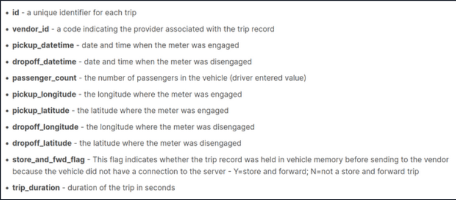
## Network Analysis
### Basic Information :
4426 Nodes and 9629 Edges

Directed Graph

Average InDegree = Average Outdegree = 2.1749

After creating a new simple graph the average degree went up to 3.5635

### Degree Distribution in Simple Graph
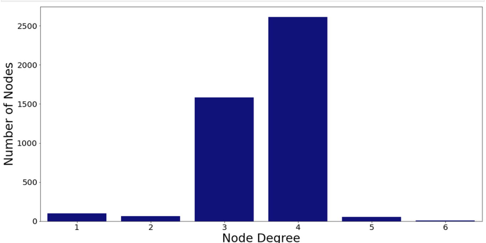
majority of nodes have degree 3 or 4. Derived from the grid like structure of manhattan

### Degree Distribution in Directed Graph
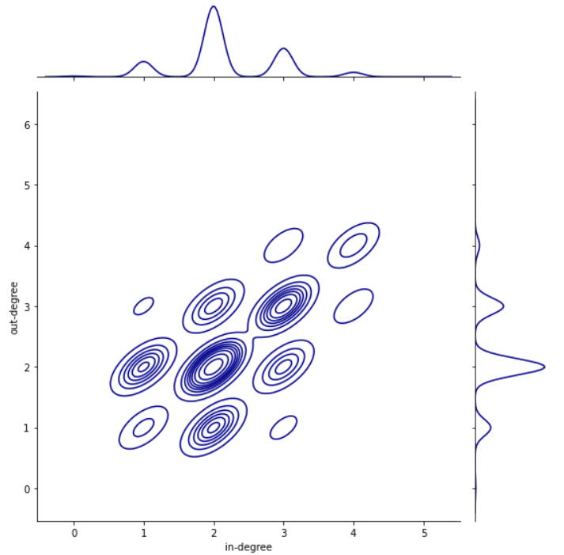

Most nodes with 2 incoming edges have 2 outgoing edges. Confirms the grid like structure

**Density of Graph = 0.00049** 
## Visualization
### Simple Networkx visualization of Directed Graph
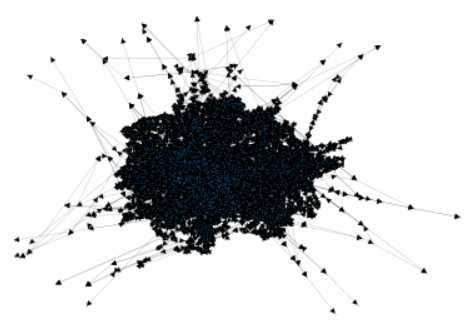
### Simple Networkx visualization of Simple Graph
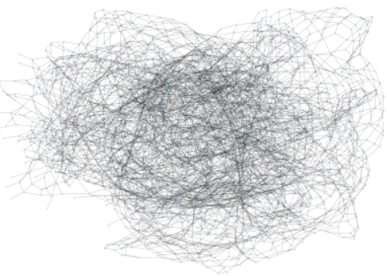

Simple visualization is too complicated and not insightful even after converting to a simple graph, no structure can be deduced.

A clever workaround for visualization is to plot the coordinates of pickup and dropoff locations of taxi trips, which over a sufficient period of time spans the entire city. As all of the coordinates are very precise and almost all unique we approximate upto 2 decimal digits and group several very nearby coordinates into 1 coordinate

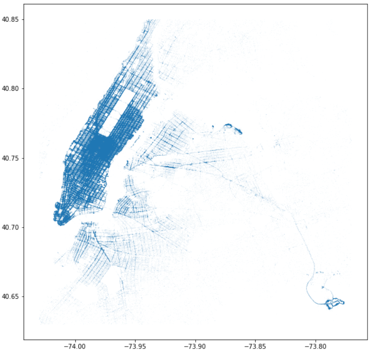

Also used the Folium library to visualize the density of taxi trips on a real interactive map :

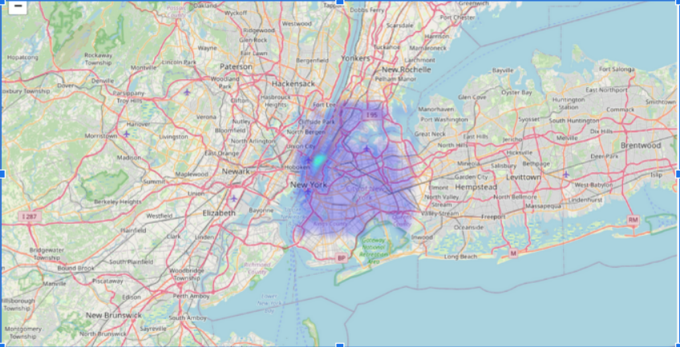

Performed Clustering on this graph to divide Manhattan into regions and the results were similar to the actual segregation of Manhattan

Actual Map : 

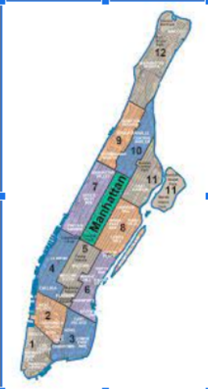

Results after K-Means Clustering :

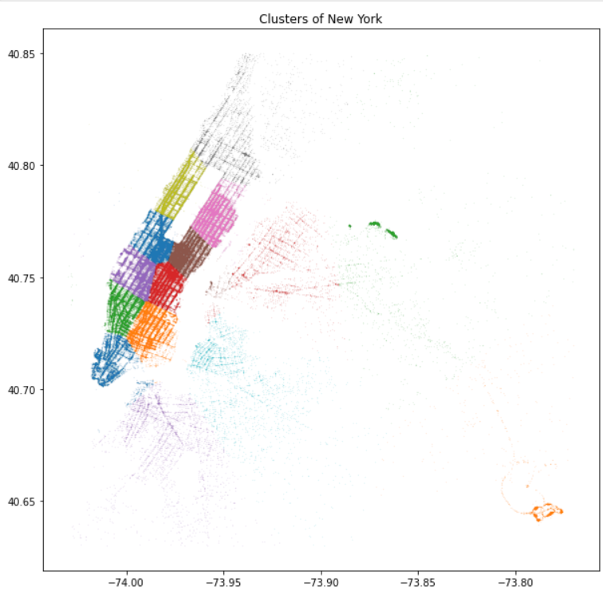

Cluster Centers :

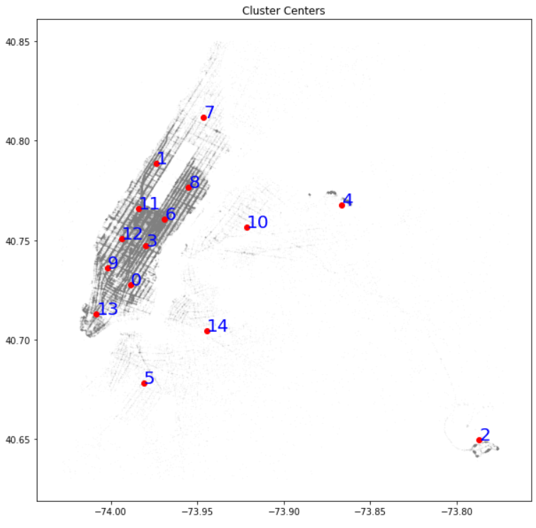

## Network Properties

Diameter of Graph = 88
Average Shortest Path Length = 35.0467
Number of Components = 1
Node Connectivity = 1 (a leaf node)
Algebraic Connectivity = 0.00034232

### Centrality Measures :
### Closeness Centrality
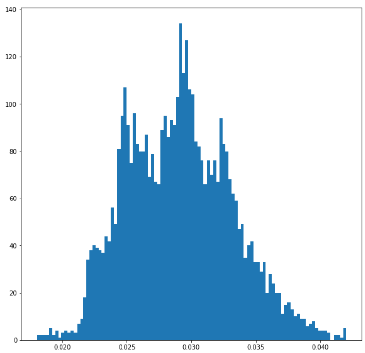
### PageRank
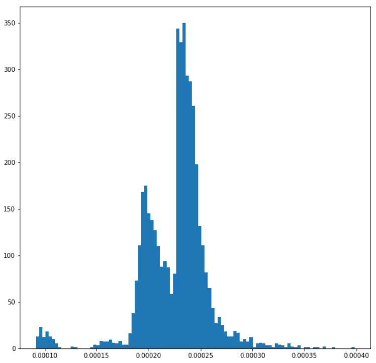
### Betweeness Centrality
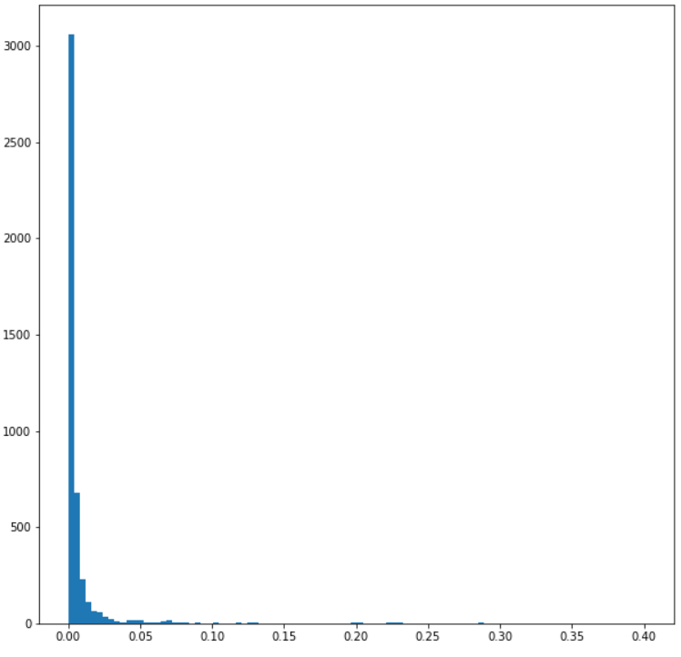

Closeness Centrality and Pagerank is approximately normally distributed, the most important observation comes from betweeness centrality as there are very few nodes with very high Betweeness Centrality which can act as bottlenecks to our street network, and traffic congestions can occur at these places.

## Shortest Paths
Given the coordinates for starting and ending points we find the nearest coordinates in our dataset to those points and then use the inbuilt shortest path alorithm from the NetworkX library. We obtain the shortest path through which we can travel in the form of node ID's and then also calculated the betweenes  centralities of all the nodes in the path.
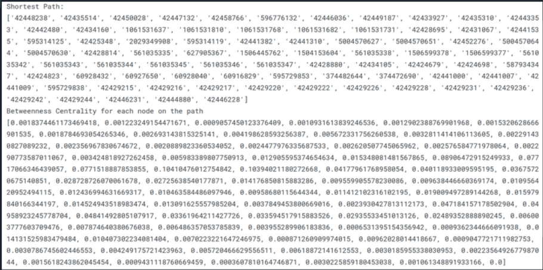
